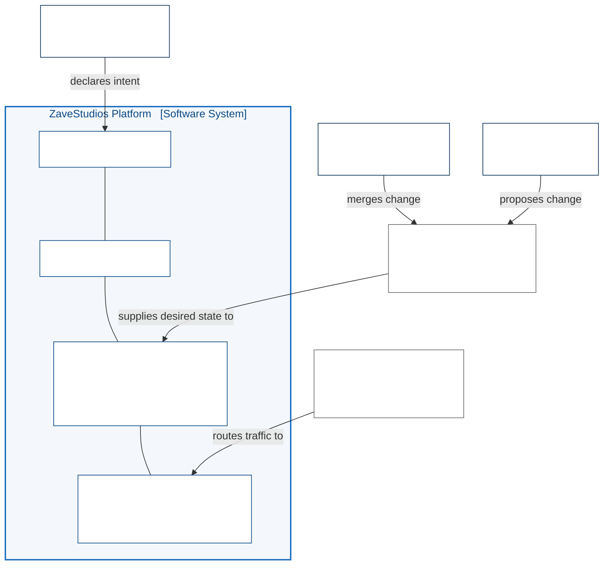

ZaveStudios is built around a baseline path: workloads declare intent, and the platform supplies the secure delivery and runtime mechanics.

The architecture brings DevSecOps, secure data engineering, data pipelines, and operational AI into one governed shape. Shared platform services provide delivery, data-service integration, observability, policy, and model access through consistent interfaces.

## The Platform at a Glance

Four layers, from the metal up. Each is opened in its own view.

Nobody changes the platform by touching it. Intent is declared, change is
merged, and the cluster pulls what Git says should be true.

Notation follows the [C4 model](https://c4model.com/): people, the system in
scope, and external systems, with each relationship labelled by what it does.

## The Four Views

1. **Substrate and Ingress** — VMs, cluster nodes, network, and how external
   traffic reaches a workload
2. **Inside the Cluster** — the control planes, and what owns state at each
3. **Platform Services** — the shared capabilities tenants consume
4. **Tenant Workloads** — what actually runs, and how it is registered
