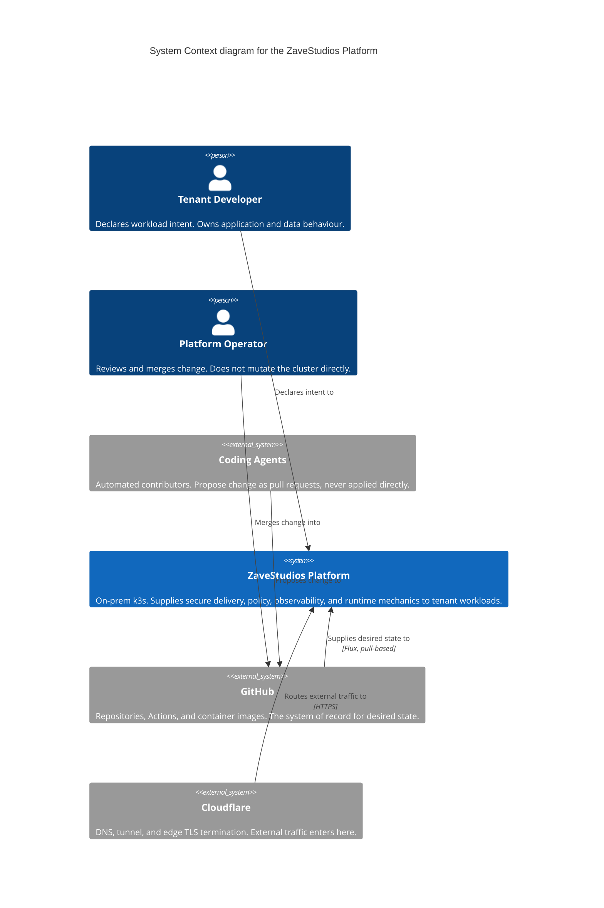

ZaveStudios is built around a baseline path: workloads declare intent, and the platform supplies the secure delivery and runtime mechanics.

The architecture brings DevSecOps, secure data engineering, data pipelines, and operational AI into one governed shape. Shared platform services provide delivery, data-service integration, observability, policy, and model access through consistent interfaces.

## System Context

Who touches the platform, and what it depends on.

Nobody changes the platform by touching it. Intent is declared, change is
merged, and the cluster pulls what Git says should be true. That is why the
operator and the coding agents point at GitHub rather than at the platform —
only the tenant developer addresses it directly.

Notation follows the [C4 model](https://c4model.com/). This is a Level 1
context diagram, so the platform is deliberately a single box: it shows who
uses it and what it depends on, and nothing about how it is built. The views
below open it up.

## The Four Views

Four layers, from the metal up. Each is opened in its own page.

1. **Substrate and Ingress** — VMs, cluster nodes, network, and how external
   traffic reaches a workload
2. **Inside the Cluster** — the control planes, and what owns state at each
3. **Platform Services** — the shared capabilities tenants consume
4. **Tenant Workloads** — what actually runs, and how it is registered
